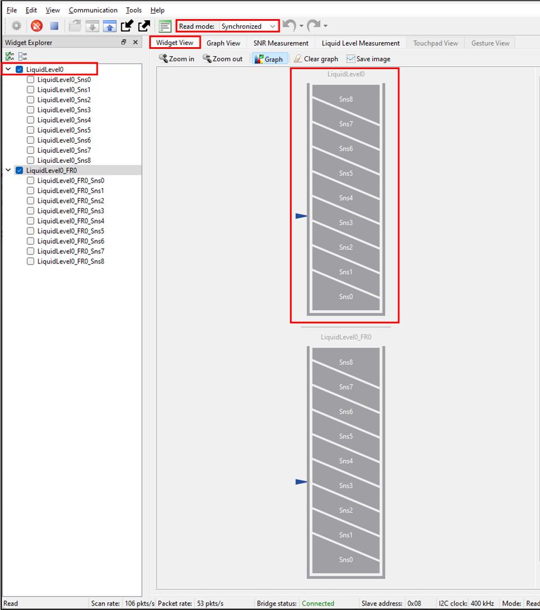
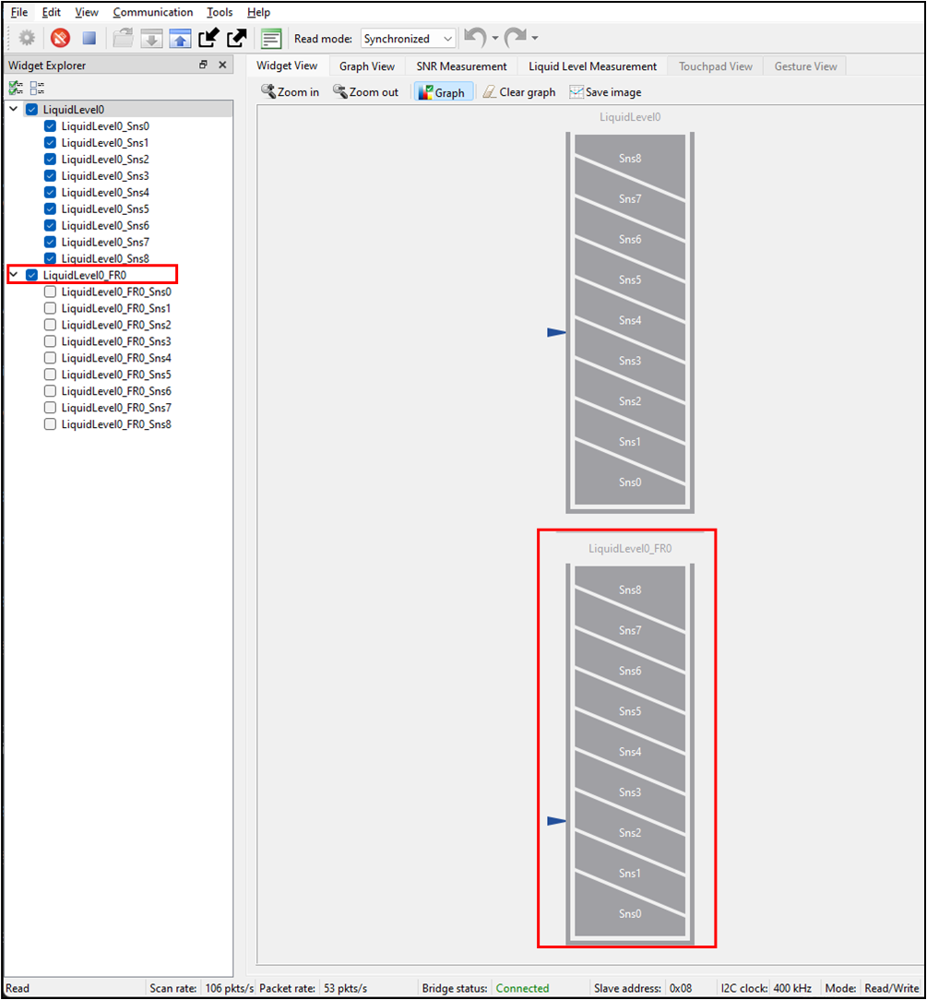
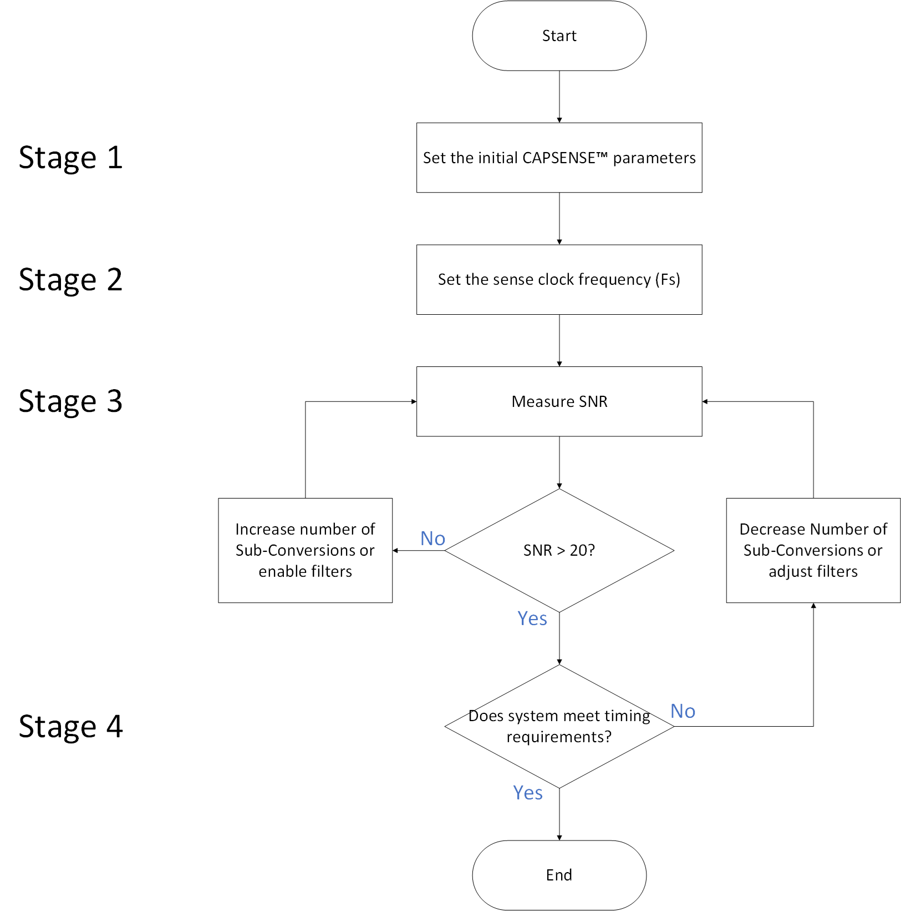
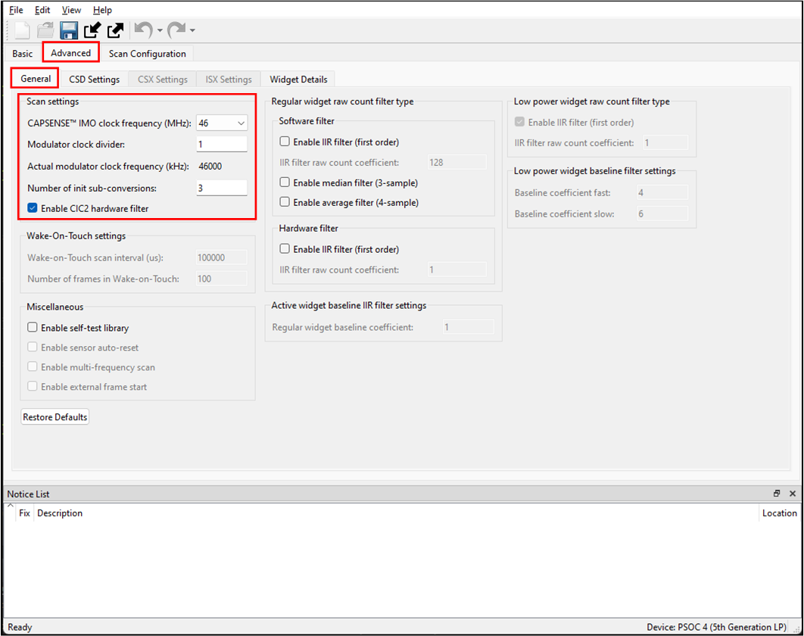
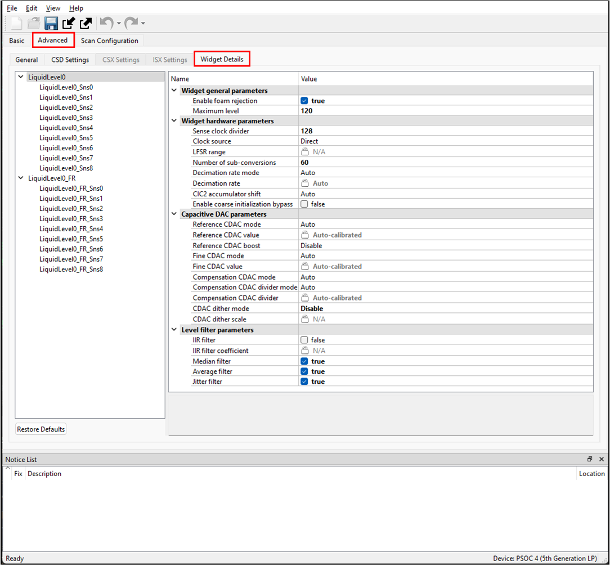
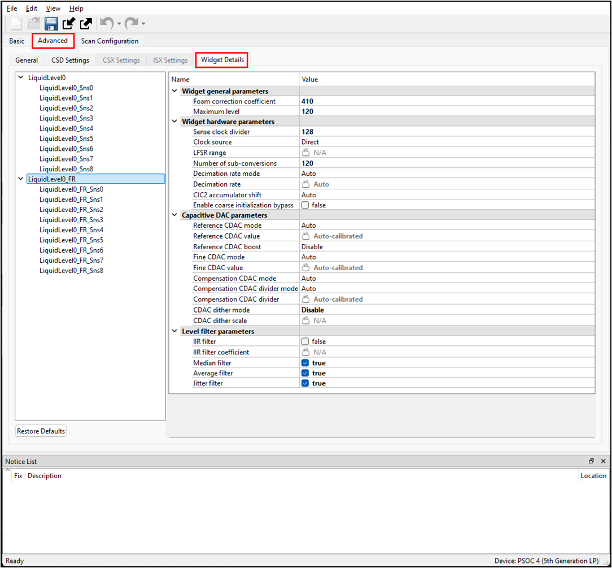
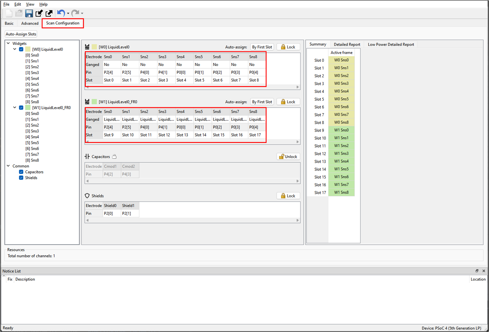
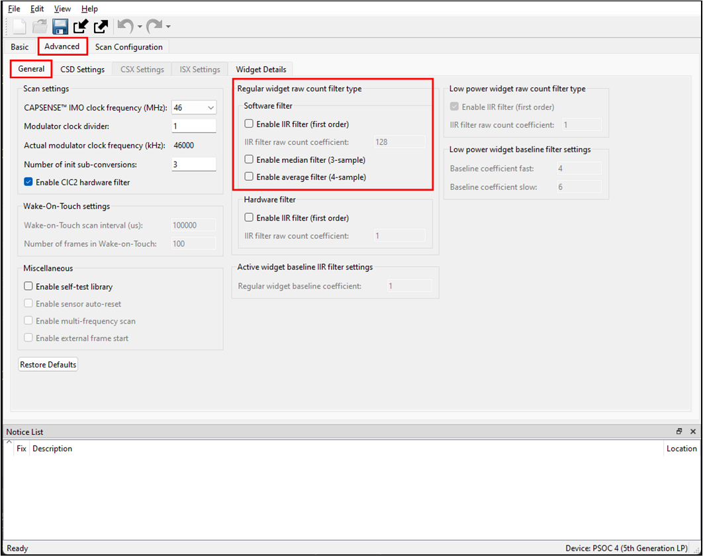
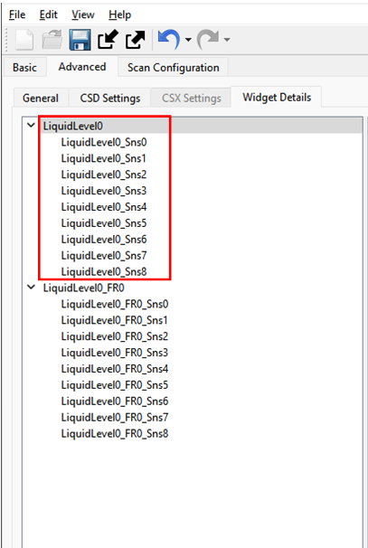
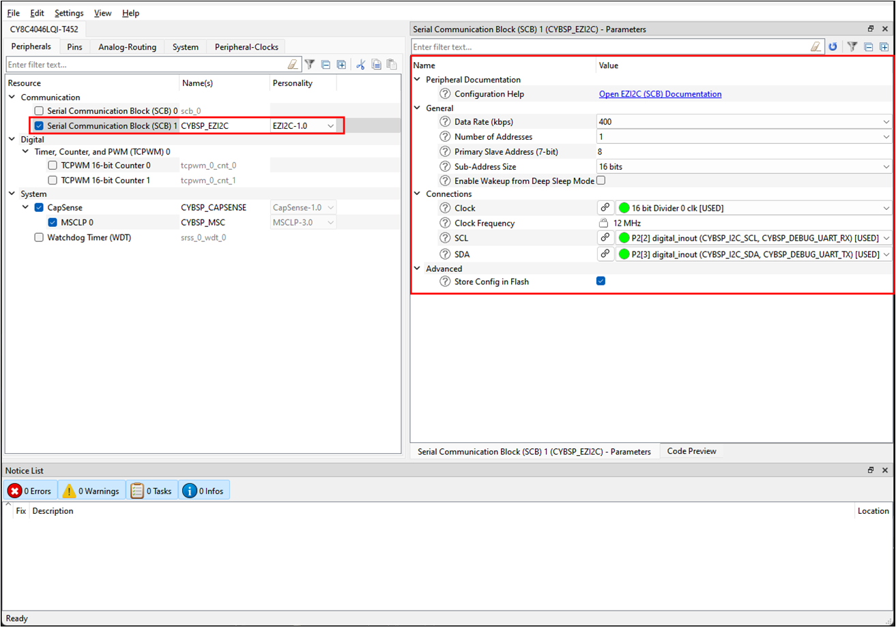

# PSOC&trade; 4: MSCLP CAPSENSE&trade; liquid level sensing

This code example demonstrates an implementation of capacitive sensors to measure the depth of water-based liquids in nonconductive containers. Mounted on or near the container exterior, these sensors provide accurate, real-time monitoring of liquid fill levels, while also rejecting foam interference and eliminating the need for physical contact with the liquid.


[View this README on GitHub.](https://github.com/Infineon/mtb-example-psoc4-msclp-lls)

[Provide feedback on this code example.](https://cypress.co1.qualtrics.com/jfe/form/SV_1NTns53sK2yiljn?Q_EED=eyJVbmlxdWUgRG9jIElkIjoiQ0UyNDA1MzUiLCJTcGVjIE51bWJlciI6IjAwMi00MDUzNSIsIkRvYyBUaXRsZSI6IlBTT0MmdHJhZGU7IDQ6IE1TQ0xQIENBUFNFTlNFJnRyYWRlOyBsaXF1aWQgbGV2ZWwgc2Vuc2luZyIsInJpZCI6Inlhc2h2aSIsIkRvYyB2ZXJzaW9uIjoiNC4wLjAiLCJEb2MgTGFuZ3VhZ2UiOiJFbmdsaXNoIiwiRG9jIERpdmlzaW9uIjoiTUNEIiwiRG9jIEJVIjoiSUNXIiwiRG9jIEZhbWlseSI6IlBTT0MifQ==)


## Requirements


- [ModusToolbox&trade;](https://www.infineon.com/modustoolbox) v3.6 or later 

   > **Note:** This code example requires ModusToolbox&trade; v3.6 and is not backward compatible with older versions.

- Board support package (BSP) minimum required version: 3.3.0
- Programming language: C
- Associated parts: [PSOC&trade; 4000T](https://www.infineon.com/products/microcontroller/32-bit-psoc-arm-cortex/psoc-4-mcu/4000/4000t), [PSOC&trade; 4100T Plus](https://www.infineon.com/products/microcontroller/32-bit-psoc-arm-cortex/psoc-4-mcu/4100/psoc-4100t-plus) 


## Supported toolchains (make variable 'TOOLCHAIN')

- GNU Arm&reg; Embedded Compiler v11.3.1 (`GCC_ARM`) – Default value of `TOOLCHAIN`
- Arm&reg; Compiler v6.22 (`ARM`)
- IAR C/C++ Compiler v9.50.2 (`IAR`)


## Supported kits (make variable 'TARGET')


- [PSOC&trade; 4000T Multi-Sense Prototyping Kit](https://www.infineon.com/CY8CPROTO-040T-MS) (`CY8CPROTO-040T-MS`) – Default value of `TARGET`
- [PSOC&trade; 4100T Plus CAPSENSE&trade; Prototyping Kit](https://www.infineon.com/CY8CPROTO-041TP) (`CY8CPROTO-041TP`)


## Hardware setup

This example uses the board's default configuration. See the kit user guide to configure the required operating voltage on the kit and to setup the VDDA supply voltage, see the [Set up the VDDA supply voltage and debug mode in Device Configurator](#set-up-the-vdda-supply-voltage-and-debug-mode-in-device-configurator) section.

This application is tuned to perform optimally at the default voltage. However, you can observe the basic functionality at other supported voltages.

> **Note:** Some PSOC&trade; 4 kits ship with KitProg2 installed. ModusToolbox&trade; requires KitProg3. Before using this code example, make sure that the board is upgraded to KitProg3. The tool and instructions are available in the [Firmware Loader](https://github.com/Infineon/Firmware-loader) GitHub repository. If you do not upgrade, you will see an error like "unable to find CMSIS-DAP device" or "KitProg firmware is out of date".


## Software setup

See the [ModusToolbox&trade; tools package installation guide](https://www.infineon.com/ModusToolboxInstallguide) for information about installing and configuring the tools package.


## Using the code example


### Create the project

The ModusToolbox&trade; tools package provides the Project Creator as both a GUI tool and a command line tool.

<details><summary><b>Use Project Creator GUI</b></summary>

1. Open the Project Creator GUI tool

   There are several ways to do this, including launching it from the dashboard or from inside the Eclipse IDE. For more details, see the [Project Creator user guide](https://www.infineon.com/ModusToolboxProjectCreator) (locally available at *{ModusToolbox&trade; install directory}/tools_{version}/project-creator/docs/project-creator.pdf*)

2. On the **Choose Board Support Package (BSP)** page, select a kit supported by this code example. See [Supported kits](#supported-kits-make-variable-target)

   > **Note:** To use this code example for a kit not listed here, you may need to update the source files. If the kit does not have the required resources, the application may not work

3. On the **Select Application** page:

   a. Select the **Applications(s) Root Path** and the **Target IDE**

      > **Note:** Depending on how you open the Project Creator tool, these fields may be pre-selected for you

   b. Select this code example from the list by enabling its check box

      > **Note:** You can narrow the list of displayed examples by typing in the filter box

   c. (Optional) Change the suggested **New Application Name** and **New BSP Name**

   d. Click **Create** to complete the application creation process

</details>


<details><summary><b>Use Project Creator CLI</b></summary>

The 'project-creator-cli' tool can be used to create applications from a CLI terminal or from within batch files or shell scripts. This tool is available in the *{ModusToolbox&trade; install directory}/tools_{version}/project-creator/* directory.

Use a CLI terminal to invoke the 'project-creator-cli' tool. On Windows, use the command-line 'modus-shell' program provided in the ModusToolbox&trade; installation instead of a standard Windows command-line application. This shell provides access to all ModusToolbox&trade; tools. You can access it by typing "modus-shell" in the search box in the Windows menu. In Linux and macOS, you can use any terminal application.

The following example clones the "[PSOC&trade; 4: MSCLP CAPSENSE&trade; liquid level sensing](https://github.com/Infineon/mtb-example-psoc4-msclp-lls)" application with the desired name "MyLLS" configured for the *CY8CPROTO-040T-MS* BSP into the specified working directory, *C:/mtb_projects*:

   ```
   project-creator-cli --board-id CY8CPROTO-040T-MS --app-id mtb-example-psoc4-msclp-lls --user-app-name MyLLS --target-dir "C:/mtb_projects"
   ```

The 'project-creator-cli' tool has the following arguments:

Argument | Description | Required/optional
---------|-------------|-----------
`--board-id` | Defined in the <id> field of the [BSP](https://github.com/Infineon?q=bsp-manifest&type=&language=&sort=) manifest | Required
`--app-id`   | Defined in the <id> field of the [CE](https://github.com/Infineon?q=ce-manifest&type=&language=&sort=) manifest | Required
`--target-dir`| Specify the directory in which the application is to be created if you prefer not to use the default current working directory | Optional
`--user-app-name`| Specify the name of the application if you prefer to have a name other than the example's default name | Optional

<br>

> **Note:** The project-creator-cli tool uses the `git clone` and `make getlibs` commands to fetch the repository and import the required libraries. For details, see the "Project creator tools" section of the [ModusToolbox&trade; tools package user guide](https://www.infineon.com/ModusToolboxUserGuide) (locally available at {ModusToolbox&trade; install directory}/docs_{version}/mtb_user_guide.pdf).

</details>


### Open the project

After the project has been created, you can open it in your preferred development environment.


<details><summary><b>Eclipse IDE</b></summary>

If you opened the Project Creator tool from the included Eclipse IDE, the project will open in Eclipse automatically.

For more details, see the [Eclipse IDE for ModusToolbox&trade; user guide](https://www.infineon.com/MTBEclipseIDEUserGuide) (locally available at *{ModusToolbox&trade; install directory}/docs_{version}/mt_ide_user_guide.pdf*).

</details>


<details><summary><b>Visual Studio (VS) Code</b></summary>

Launch VS Code manually, and then open the generated *{project-name}.code-workspace* file located in the project directory.

For more details, see the [Visual Studio Code for ModusToolbox&trade; user guide](https://www.infineon.com/MTBVSCodeUserGuide) (locally available at *{ModusToolbox&trade; install directory}/docs_{version}/mt_vscode_user_guide.pdf*).

</details>


<details><summary><b>Arm&reg; Keil&reg; µVision&reg;</b></summary>

Double-click the generated *{project-name}.cprj* file to launch the Keil&reg; µVision&reg; IDE.

For more details, see the [Arm&reg; Keil&reg; µVision&reg; for ModusToolbox&trade; user guide](https://www.infineon.com/MTBuVisionUserGuide) (locally available at *{ModusToolbox&trade; install directory}/docs_{version}/mt_uvision_user_guide.pdf*).

</details>


<details><summary><b>IAR Embedded Workbench</b></summary>

Open IAR Embedded Workbench manually, and create a new project. Then select the generated *{project-name}.ipcf* file located in the project directory.

For more details, see the [IAR Embedded Workbench for ModusToolbox&trade; user guide](https://www.infineon.com/MTBIARUserGuide) (locally available at *{ModusToolbox&trade; install directory}/docs_{version}/mt_iar_user_guide.pdf*).

</details>


<details><summary><b>Command line</b></summary>

If you prefer to use the CLI, open the appropriate terminal, and navigate to the project directory. On Windows, use the command-line 'modus-shell' program; on Linux and macOS, you can use any terminal application. From there, you can run various `make` commands.

For more details, see the [ModusToolbox&trade; tools package user guide](https://www.infineon.com/ModusToolboxUserGuide) (locally available at *{ModusToolbox&trade; install directory}/docs_{version}/mtb_user_guide.pdf*).

</details>


## Operation

1. Ensure the board is connected with the Liquid Level Sensing Flex PCB

   > **Note:** If a custom container is used other than the bottle provided with the kit, the system may need a liquid level factory calibration as mentioned in the [Perform liquid level calibration](#perform-liquid-level-calibration) section

2. Connect the board to your PC using the provided USB cable through the KitProg3 USB connector

3. Program the board using one of the following:

   > **Note:** It is essential to completely empty the tank before programming to ensure accurate one-time calibration. See the [One-time factory auto-calibration](#one-time-factory-auto-calibration) section for further details

   <details><summary><b>Using Eclipse IDE</b></summary>

      1. Select the application project in the Project Explorer

      2. In the **Quick Panel**, scroll down, and click **\<Application Name> Program (KitProg3_MiniProg4)**
   </details>


   <details><summary><b>In other IDEs</b></summary>

   Follow the instructions in your preferred IDE.

   </details>


   <details><summary><b>Using CLI</b></summary>

     From the terminal, execute the `make program` command to build and program the application using the default toolchain to the default target. The default toolchain is specified in the application's Makefile but you can override this value manually:
      ```
      make program TOOLCHAIN=<toolchain>
      ```

      Example:
      ```
      make program TOOLCHAIN=GCC_ARM
      ```
   </details>

4. After programming, the application starts automatically

   > **Note:** After programming, you may see the following error message if debug mode is disabled, see **Table 6** in the [Debugging](#debugging) section for the default debug configuration in the supported kits. This can be ignored or enabling debug solves this error

   ``` c
   "Error: Error connecting Dp: Cannot read IDR"
   ```


### Monitor data using CAPSENSE&trade; Tuner

1. Open CAPSENSE&trade; Tuner from the **IDE Quick Panel** of Eclipse for ModusToolbox&trade;

   You can also run the CAPSENSE&trade; Tuner application in standalone mode from *{ModusToolbox&trade; install directory}/ModusToolbox/tools_{version}/capsense-configurator/capsense-tuner*. In this case, after opening the application, select **File** > **Open** and open the *design.cycapsense* file of the respective application, which is present in the *{Application root directory}/bsps/TARGET_APP_\<BSP-NAME>/config* folder

   See the [ModusToolbox&trade; user guide](https://www.infineon.com/ModusToolboxUserGuide) (locally available at *{ModusToolbox&trade; install directory}/docs_{version}/mtb_user_guide.pdf*) for options to open the CAPSENSE&trade; Tuner application using the CLI

2. Ensure that the status LED is on and not blinking, which indicates that the onboard KitProg3 is in CMSIS-DAP bulk mode. See [Firmware-loader](https://github.com/Infineon/Firmware-loader) to learn how to update the firmware and switch modes in KitProg3

3. In the Tuner application, click on the **Tuner Communication Setup** icon or select **Tools** > **Tuner Communication setup**

   In the window that appears, select I2C under KitProg3 and configure it as follows:

   - **I2C address:** 8
   - **Sub-address:** 2-Bytes
   - **Speed (kHz):** 400

   These are the same values set in the EZI2C resource

   **Figure 1. Tuner Communication Setup parameters**

    

4. Click **Connect** or select **Communication** > **Connect** to establish a connection

   **Figure 2. Establish a connection**

   


5. Click **Start** or select **Communication** > **Start** to start data streaming from the device

   **Figure 3. Start tuner communication**

   

   The **Widget/Sensor Parameters** tab is updated with the parameters configured in the CAPSENSE&trade; Configurator window. The tuner displays the data from the sensor in **Widget View** and **Graph View** tabs

6. Set the **Read mode** to **Synchronized**. Navigate to the **Widget View** tab and observe the needle in the **Liquid_Level_Sensor_FR** widget is changing as you pour or remove water in the container

   **Figure 4. Widget view of the CAPSENSE&trade; Tuner**

   

7. Add a layer of foam on top of the liquid, facilitated by a surfactant, and observe how the liquid level remains unaffected by the foam, as reported by the **Liquid_Level_Sensor_FR** widget. This demonstrates the system's ability to reject foam and maintain accurate liquid level sensing

   **Figure 5. Widget view of the CAPSENSE&trade; Tuner**

   

   > **Note:** The Level in the **Liquid_Level_Sensor** changes due to the foam as it is a normal liquid level sensor and does not incorporate the foam rejection capability

8. View the raw counts of the liquid level sensors through the **Graph View tab**. The normal liquid level and foam-rejected liquid level can be observed in the position window

   **Figure 6. Liquid Level Sensor position**

   

9. Switch to the **SNR Measurement** tab and verify that the SNR is above **20:1** by performing the following steps:

   1. Select the **Liquid_Level_0_Sns0** sensor under the **Liquid_Level_0** widget and click **Acquire Noise**, as shown in **Figure 7**. Repeat the same (**Acquire Noise**) for all sensors under the **Liquid_Level_0** widget
      
      **Figure 7. CAPSENSE&trade; Tuner - SNR measurement: Acquire Noise**

      

   2. Fill the tank to the maximum level, Select the **Liquid_Level_0_Sns0** sensor under the **Liquid_Level_0** widget, and click **Acquire Signal**, as shown in **Figure 8** and wait for the SNR measurement to complete. Repeat the same (**Acquire Signal**) for all the sensors under the **Liquid_Level_0** widget

      **Figure 8. CAPSENSE&trade; Tuner - SNR measurement: Acquire Signal**

      
 
      Ensure that the SNR is above **20:1**


## Tuning procedure

<details><summary><b>Create a custom BSP for your board</b></summary>

1. Create a custom BSP for your board with any device by following the steps given in [ModusToolbox&trade; BSP Assistant user guide](https://www.infineon.com/ModusToolboxBSPAssistant). This code example is created for the CY8C4046LQI-T452 device

2. Open the *design.modus* file from the *{Application root directory}/bsps/TARGET_APP_\<BSP-NAME>/config/* folder obtained in the previous step and enable CAPSENSE&trade; to get the *design.cycapsense* file. CAPSENSE&trade; configuration can be started from scratch as follows:

</details>

<br>

> **Note:** See the "Selecting CAPSENSE&trade; hardware parameters" section in [AN85951 – PSOC&trade; 4 and PSOC&trade; 6 MCU CAPSENSE&trade; design guide](https://www.infineon.com/AN85951) to learn the considerations for selecting each parameter value.

The tuning flow of the **Liquid Level Sensing** widget is shown in **Figure 9**.

**Figure 9. Tuning flow of liquid level sensor**



<br>

Perform the following to tune the **Liquid Level Sensing** widget:

- [Stage 1: Set the initial hardware parameters](#stage-1-set-the-initial-hardware-parameters)

- [Stage 2: Set the sense clock frequency](#stage-2-set-sense-clock-frequency)

- [Stage 3: Fine tune for the required SNR](#stage-3-fine-tune-for-required-snr)


### Stage 1: Set the initial hardware parameters

1. Connect the board to your PC using the provided USB cable through the KitProg3 USB connector

2. Launch the Device Configurator tool

   You can launch the Device Configurator in Eclipse IDE for ModusToolbox&trade; from the **Quick Panel** or in standalone mode from *{ModusToolbox&trade; install directory}/ModusToolbox/tools_{version}/device-configurator/device-configurator*. In this case, after opening the application, select **File** > **Open** and open the *design.modus* file of the respective application located in the *{Application root directory}/bsps/TARGET_APP_\<BSP-NAME>/config* folder

3. Enable the CAPSENSE&trade; channel in the Device Configurator tool as shown in **Figure 10**:

   **Figure 10. Enable CAPSENSE&trade; in Device Configurator**

   

   Save the changes and close the window

4. Launch the CAPSENSE&trade; Configurator tool

   You can launch the CAPSENSE&trade; Configurator tool in Eclipse IDE for ModusToolbox&trade; from the "CAPSENSE&trade;" peripheral setting in the Device Configurator or directly from the **IDE Quick Panel**

   You can also launch it in standalone mode through *{ModusToolbox&trade; install directory}/ModusToolbox/tools_{version}/capsense-configurator/capsense-configurator*. In this case, after opening the application, select **File** > **Open** and open the *design.cycapsense* file of the respective application present in the *{Application root directory}/bsps/TARGET_APP_\<BSP-NAME>/config* folder

   See the [ModusToolbox&trade; CAPSENSE&trade; Configurator user guide](https://www.infineon.com/ModusToolboxCapSenseConfig) for step-by-step instructions on how to configure and launch CAPSENSE&trade; in ModusToolbox&trade;

5. In the **Basic** tab, configure a **Liquid Level Sensing** widget as a CSD RM (self-capacitance). The **Liquid Level sensing** widget comprises a number of sensing elements called segments. The widget uses the data from each segment to calculate the liquid level

   **Figure 11. CAPSENSE&trade; Configurator - Basic tab**

   


6. Do the following in the **General** tab under the **Advanced** tab:

   **Table 1. Widget details**

   Parameter | Setting | Description
   :-------- |:----------- |:-----------
   CAPSENSE&trade; IMO clock frequency (MHz) | 46 | IMO clock frequency
   Modulator clock divider | 1 | Set to obtain the optimum modulator clock frequency
   Number of init sub-conversions | 3 | Set to ensure proper initialization of CAPSENSE&trade;
   Enable CIC2 hardware filter | TRUE | Enabling CIC2 filter helps in higher SNR

   <br>
    
   **Figure 12. CAPSENSE&trade; Configurator - General settings**

   

7. Go to the **CSD Settings** tab and make the following changes:

   **Table 2. Scan settings**

   Parameter | CY8CPROTO-040T-MS | Description
   :-------- |:----------- |:-----------
   Inactive sensor connection | Shield | Connects the inactive sensors (configured sensors which have not been scanned in a given scan-slot) to the driven shield
   Shield mode | Active | The driven shield is a signal that replicates the sensor-switching signal. It helps reduce the sensor parasitic capacitance
   Total shield count | 2 |  Selects the number of shield electrodes used in the design. Most designs work with one dedicated shield electrode, but some designs require multiple dedicated shield electrodes to ease the PCB layout routing or minimize the PCB area used for the shield layer
   Raw count calibration level (%) | 40 | If the sensor raw count saturates (equals maximum raw count) on water covering the sensor, reduce the raw count calibration level (%). This will prevent raw count saturation

   <br>
   
   **Figure 13. CAPSENSE&trade; Configurator - Advanced CSD settings**

   

8. Go to the **Widget Details** tab

   Select the **LiquidLevel0** from the left pane and set the following:

   **Table 3. Initial widget parameter setting LiquidLevel0**

   Parameter | Setting | Description
   :-------- |:----------- |:-----------
   Enable foam rejection | true | This is to enable the Foam Rejection Widget for the Foam Rejection functionality
   Maximum level | 120 | Set this value to a multiple of the total depth of the tank. For example, this project uses a 12 cm tank. Therefore, the value may be 120, 240, or 1200; however, this project has used 120, for every 1 count 1 mm will be measured
   Sense clock divider | Default | Value will be set in [Stage 2: Set sense clock frequency](#stage-2-set-sense-clock-frequency)
   Clock source | Direct | Direct clock is a constant frequency sense clock source. When you choose this option, the sensor pin switches with a constant frequency
   Number of sub-conversions | 60 | Good starting point to ensure a fast scan time and sufficient signal. This value has to be adjusted as required in [Stage 3: Fine-tune for required SNR](#stage-3-fine-tune-for-required-snr)
   Reference CDAC mode  | Auto  | Setting it to Auto for initial Auto Calibration
   Reference CDAC boost | Disable  | Not required
   Fine CDAC mode | Auto | Setting it to Auto for initial Auto Calibration
   Compensation CDAC mode | Auto | Setting it to Auto for initial Auto Calibration
   Compensation CDAC divider mode | Auto | Setting it to Auto for initial Auto Calibration
   CDAC dither mode | Disable | Not required
   IIR filter | false | Not required
   Median filter | true | Essential to remove sudden spikes in the level measurement due to calculation errors
   Average filter | true | Removes periodic noises like noise from AC mains
   Jitter filter | true | Removes toggling of the position data

   <br>

   **Figure 14. CAPSENSE&trade; Configurator - Liquid Level Sensor Widget Details**

   


   Select the **LiquidLevel0_FR** from the left pane and set the following:

   **Table 4. Initial widget parameter setting LiquidLevel0_FR**

   Parameter | Setting | Description
   :-------- |:----------- |:-----------
   Foam correction coefficient | 64 | This is to compensate for the foam correction level. To accurately calculate this value, follow the steps mentioned in the "Foam rejection coefficient calculation" section of [AN239805 – Liquid-level sensing with PSOC&trade; 4 CAPSENSE&trade;](https://www.infineon.com/AN239805)
   Maximum level | Same as **LiquidLevel0** widget | –
   Sense clock divider | Same as **LiquidLevel0** widget | –
   Clock source | Same as **LiquidLevel0** widget | –
   Number of sub-conversions | 2X of the **LiquidLevel0** | General guidance is to set the number of sub-conversions to twice the number of sub-conversions for the base widget
   Reference CDAC mode  | Auto  | Setting it to Auto for initial Auto Calibration
   Reference CDAC boost | Disable  | Not required
   Fine CDAC mode | Auto | Setting it to Auto for initial Auto Calibration
   Compensation CDAC mode | Auto | Setting it to Auto for initial Auto Calibration
   Compensation CDAC divider mode | Auto | Setting it to Auto for initial Auto Calibration
   CDAC dither mode | Disable | Not required
   IIR filter | false | Not required
   Median filter | true | Essential to remove sudden spikes in the level measurement due to calculation errors
   Average filter | true | Removes periodic noise like noise from AC mains
   Jitter filter | true | Removes toggling of the position data

   <br>

   **Figure 15. CAPSENSE&trade; Configurator - Liquid Level Foam Rejection Widget Details**

   


9. Go to the **Scan Configuration** tab to select the pins and scan slots. Configure the pins for electrodes using the drop down menu

   Ensure that the bottom most sensor is considered as Sensor 0 (Sns0) and the top most sensor is considered as Sensor N (SnsN)

10. The electrodes for the Liquid Level Foam Rejection widget **LiquidLevel0_FR** are same as that of the Liquid Level Widget **LiquidLevel0**. So the sensor electrodes of **LiquidLevel0** are simply ganged to LiquidLevel0_FR widget's sensor electrodes

    **Figure 16. CAPSENSE&trade; Configurator -  Scan Configuration tab**

    


### Stage 2: Set sense clock frequency

The sense clock is derived from the modulator clock using a sense clock divider and is used to scan the sensor by driving the CAPSENSE&trade; switched capacitor circuits. Both the clock source and clock divider are configurable. The sense clock divider should be configured so that the pulse width of the sense clock is long enough to let the sensor capacitance charge and discharge completely. This is verified by observing the charging and discharging waveforms of the sensor using an oscilloscope and an active probe. The sensors should be probed close to the electrode and not at the sense pins or the series resistor. 

See **Figure 17** and **Figure 18** for waveforms observed on the sensors. **Figure 17** shows proper charging when the sense clock frequency is correctly tuned. Adjust the sense clock divider so that the voltage is reaching at least 99.3 percent of VDDD in Phase 1, or VDDD/2 in Phase 0, as **Figure 18** shows. 


**Figure 17. Proper charge cycle of a sensor**


<br>

**Figure 18. Improper charge cycle of a sensor**


   
To set the proper sense clock frequency, follow these steps:

1. Program the board and launch CAPSENSE&trade; Tuner

2. Observe the charging waveform of the sensor and shield as described earlier

3. If the charging is incomplete, increase the sense clock divider. Do this in CAPSENSE&trade; Tuner by selecting the widget and editing the sense clock divider parameter in the **Widget/Sensor Parameters** panel

   > **Note:** 
   - The sense clock divider should be **divisible by 4**. This ensures that all four scan phases have equal durations
   - After editing the value, click the **Apply to Device** button and observe the waveform again. Repeat this until you observe complete settling
   - Using a passive probe will add an additional parasitic capacitance of around 15 pF; therefore, it should be considered while tuning
      
4. Click **Apply to Project** to save the configuration to your project

   **Figure 19. Sense clock divider setting**

   
      
5. Repeat this process for all the sensors and the shield. Each sensor may require a different sense clock divider value to charge or discharge completely. But all the sensors under the same widget need to have the same sense clock source, sense clock divider, and number of sub-conversions. Therefore, consider the largest sense clock divider required by the sensor for that widget

   > **Note:** Typically, shields require a high sense clock divider. Because this project utilizes a shield, obtain the required sense clock divider for the shield. If it is higher than the Liquid Level Sensor widget, set the same sense clock divider for the Liquid Level Sensor Widget as well
   
   **Table 5. Sense clock divider settings obtained for supported kits**

   Parameter |CY8CPROTO-040T-MS |CY8CPROTO-041TP
   :-------- |:----------- |:-----------
   Sense clock divider | 128 | 128
   
   <br>


### Stage 3: Fine tune for required SNR

The sensor must provide a large signal for the processing function to accurately calculate the liquid level. Liquid level sensing systems perform best with signal-to-noise ratio (SNR) values 10 or higher. The sensitivity can be increased by increasing the number of sub-conversions and noise can be decreased by enabling available filters. This section demonstrates using CAPSENSE&trade; Tuner and Configurator to measure and adjust the SNR.

Follow these steps for optimizing these parameters:

1. Measure the SNR as mentioned in **Step 9** of the [Operation](#operation) section

2. If the SNR is less than 20:1, increase the number of sub-conversions. Edit the number of sub-conversions (N<sub>sub</sub>) directly in the **Widget/Sensor parameters** tab of the CAPSENSE&trade; Tuner and click on **Apply to Device**

   > **Note:** Number of sub-conversion should be greater than or equal to 8.
  
3. Repeat steps 1 and 2 until the Measured SNR is greater than **20:1**

4. If the system is noisy (>40% of signal), enable filters

   Enable the IIR filter for noise reduction

   To enable and configure filters available in the system:

   a. Open **CAPSENSE&trade; Configurator** from ModusToolbox&trade; **Quick Panel** and select the appropriate filter

   **Figure 20. Filter settings in CAPSENSE&trade; Configurator**

   

   > **Note:** Add the filter based on the type of noise in your measurements. See [ModusToolbox&trade; CAPSENSE&trade; Configurator user guide](https://www.infineon.com/ModusToolboxCapSenseConfig) for details

   b. Click **Save** and close CAPSENSE&trade; Configurator. Program the device to update the filter settings

   > **Note:** Increasing the number of sub-conversions and enabling filters increases the scan time, which in turn reduces sensor responsiveness and increases power consumption. Therefore, the number of sub-conversions and filter configuration must be optimized to achieve a balance between SNR, power, and refresh rate


## Perform liquid level calibration

After completing the sensor tuning procedure for the expected SNR as mentioned in [Stage 3: Fine-tune for required SNR](#stage-3-fine-tune-for-required-snr), perform the liquid level calibration to train the system for level measurement.

For a detailed procedure on the liquid level calibration, refer to  section **Liquid-level calibration procedure** of [AN239805 – Liquid-level sensing with PSOC&trade; 4 CAPSENSE&trade;](https://www.infineon.com/AN239805).

This code example is pre-calibrated for use with the standard Liquid Level Sensing Kit, offering a calibrated range of 120 mm and a resolution of 1 mm.


## One-time factory auto-calibration

The CAPSENSE&trade;-based liquid-level sensing system uses frozen CDAC values, which can vary across devices and sensing setups. This impacts the level measurement accuracy. To account for these variations, use this one-time factory auto-calibration.

This helps to improve measurement accuracy by handling part-to-part variations and minor mechanical variations on sensor placement.

This code example has this one-time factory auto-calibration feature enabled at the application level. It will get calibrated during the first power on after flashing and values are stored in EEPROM.

> **Note:**  It is essential to completely empty the tank attached.

For details on one-time auto-calibration, refer to section **One-time factory auto-calibration** of [AN239805 – Liquid-level sensing with PSOC&trade; 4 CAPSENSE&trade;](https://www.infineon.com/AN239805).


## Debugging

You can debug the example to step through the code.


<details><summary><b>In Eclipse IDE</b></summary>

Use the **\<Application Name> Debug (KitProg3_MiniProg4)** configuration in the **Quick Panel**. For details, see the "Program and debug" section in the [Eclipse IDE for ModusToolbox&trade; user guide](https://www.infineon.com/MTBEclipseIDEUserGuide).


</details>


<details><summary><b>In other IDEs</b></summary>

Follow the instructions in your preferred IDE.

</details>

To enable the debug option, see the [Setup VDDA and debug mode in Device Configurator](#set-up-the-vdda-supply-voltage-and-debug-mode-in-device-configurator) section. To achieve lower power consumption, it is recommended to disable it when not debugging.

See **Table 6** for the default debug configuration in the supported kits.

**Table 6. Debug mode option status**

Kit  | Debug mode 
:----| :----------
CY8CPROTO-040T-MS | Enabled
CY8CPROTO-041TP | Enabled

<br>


## Design and implementation

The project uses [CAPSENSE&trade; middleware](https://infineon.github.io/capsense/capsense_api_reference_manual/html/index.html); see the [ModusToolbox&trade; user guide](https://www.infineon.com/MTBEclipseIDEUserGuide) for more details on selecting a middleware.

See [AN85951 – PSOC&trade; 4 and PSOC&trade; 6 MCU CAPSENSE&trade; design guide](https://www.infineon.com/an85951) for more details on CAPSENSE&trade; features and usage.

See [AN239805 – Liquid-level sensing with PSOC&trade; 4 CAPSENSE&trade;](https://www.infineon.com/AN239805) for complete details on how to create a liquid level sensing system using CAPSENSE&trade;. It also discusses how to design the liquid level sensors.

This code example uses a **Liquid Level Sensing** widget along with its **Liquid Level Sensing Foam Rejection** sub-widget to accurately measure the liquid level in the bottle as provided with the Liquid Level Sensing Kit. The **Liquid Level Sensing Foam Rejection** sub-widget provides accurate liquid level measurements while rejecting foam interference.

**Figure 21. Liquid Level Sensor widget**



<br>

**Figure 22. Liquid Level Sensor Foam Rejection sub-widget**


The design also has an EZI2C peripheral. The EZI2C slave peripheral is used to monitor the information of a sensor's raw and processed data on a PC using the CAPSENSE&trade; Tuner available in the Eclipse IDE for ModusToolbox&trade; via I2C communication.

The firmware scans the **Liquid Level Sensing** widget and the **Liquid Level Sensing Foam Rejection** sub-widget indefinitely. The scan results are then processed and sent to the CAPSENSE&trade; Tuner via the EZI2C bus. The level then can be seen under the **Position** window of the CAPSENSE&trade; Tuner.

> **Note:** In the current project, the **Liquid Level Sensing** widget and the **Liquid Level Sensing Foam Rejection** sub-widget are scanned separately and needs to be scanned separately; they will not work if scanned together by calling `Cy_CapSense_ScanAllWidgets` due to architectural limitations. This will get resolved in upcoming releases.


### Set up the VDDA supply voltage and debug mode in Device Configurator

1. Open Device Configurator tool from the **Quick Panel** of the Eclipse for ModusToolbox&trade;

2. Go to the **System** tab. Select the **Power** resource and set the VDDA value under **Operating conditions** as shown in **Figure 23**

   **Figure 23. Setting the VDDA supply in the System tab of Device Configurator**

   

3. By default, the debug mode is disabled for this application to reduce power consumption. Enable the debug mode to enable the SWD pins, as shown in **Figure 24**:

   **Figure 24. Enable Debug mode in the System tab of Device Configurator**

   


### Resources and settings


   **Figure 25. EZI2C settings**

   
   
   <br>

**Table 7. Application resources**

Resource  |  Alias/object     |    Purpose
:-------- | :-------------    | :------------
SCB (EZI2C) (PDL) | CYBSP_EZI2C | EZI2C slave driver to communicate with CAPSENSE&trade; Tuner
CAPSENSE&trade; (MSCLP0) | CYBSP_MSCLP0 | CAPSENSE&trade; driver to interact with the MSCLP hardware and interface the CAPSENSE&trade; sensors 

<br>


### Firmware flow

**Figure 26. Firmware flowchart**


## Related resources

Resources  | Links
-----------|----------------------------------
Application notes  | [AN79953](https://www.infineon.com/AN79953) – Getting started with PSOC&trade; 4 <br> [AN85951](https://www.infineon.com/AN85951) – PSOC&trade; 4 and PSOC&trade; 6 MCU CAPSENSE&trade; design guide <br> [AN239805](https://www.infineon.com/AN239805) – Liquid-level sensing with PSOC&trade; 4 CAPSENSE&trade; <br>[AN234231](https://www.infineon.com/AN234231) – PSOC&trade; 4 CAPSENSE&trade; ultra-low-power capacitive sensing techniques <br> [AN92239](https://www.infineon.com/an92239) – Proximity sensing with CAPSENSE&trade;
Code examples  | [Using ModusToolbox&trade;](https://github.com/Infineon/Code-Examples-for-ModusToolbox-Software) on GitHub
Device documentation | [PSOC&trade; 4 datasheets](https://documentation.infineon.com/psoc4/docs/qqs1702048028479) <br>[PSOC&trade; 4 technical reference manuals](https://documentation.infineon.com/psoc4/docs/hup1702048028817)
Development kits | Select your kits from the [Evaluation board finder](https://www.infineon.com/cms/en/design-support/finder-selection-tools/product-finder/evaluation-board)
Libraries on GitHub  | [mtb-pdl-cat2](https://github.com/Infineon/mtb-pdl-cat2) – PSOC&trade; 4 Peripheral Driver Library (PDL)
Middleware on GitHub  | [capsense](https://github.com/Infineon/capsense) – CAPSENSE&trade; library and documents <br> [psoc4-middleware](https://github.com/Infineon/modustoolbox-software#libraries) – Links to all PSOC&trade; 4 middleware
Tools  | [ModusToolbox&trade;](https://www.infineon.com/modustoolbox) – ModusToolbox&trade; software is a collection of easy-to-use libraries and tools enabling rapid development with Infineon MCUs for applications ranging from wireless and cloud-connected systems, edge AI/ML, embedded sense and control, to wired USB connectivity using PSOC&trade; Industrial/IoT MCUs, AIROC&trade; Wi-Fi and Bluetooth&reg; connectivity devices, XMC&trade; Industrial MCUs, and EZ-USB&trade;/EZ-PD&trade; wired connectivity controllers. ModusToolbox&trade; incorporates a comprehensive set of BSPs, HAL, libraries, configuration tools, and provides support for industry-standard IDEs to fast-track your embedded application development

<br>


## Other resources

Infineon provides a wealth of data at [www.infineon.com](https://www.infineon.com) to help you select the right device, and quickly and effectively integrate it into your design.


## Document history

Document title: *CE240535* – *PSOC&trade; 4: MSCLP CAPSENSE&trade; liquid level sensing*

Version | Description of change
------- | ---------------------
1.0.0   | New code example
2.0.0   | Major update to support ModusToolbox&trade; v3.3. This version is not backward compatible with previous versions of ModusToolbox&trade;
2.1.0   | Removed foam rejection calibration process
3.0.0   | Added support for CY8CPROTO-041TP Prototyping Kit. Major update to support ModusToolbox&trade; v3.5. This version is not backward compatible with previous versions of ModusToolbox&trade;
4.0.0   | Added one-time auto-calibration feature <br> Major update to support ModusToolbox&trade; v3.6. This version is not backward compatible with previous versions of ModusToolbox&trade;
<br>


All referenced product or service names and trademarks are the property of their respective owners.

The Bluetooth&reg; word mark and logos are registered trademarks owned by Bluetooth SIG, Inc., and any use of such marks by Infineon is under license.

PSOC&trade;, formerly known as PSoC&trade;, is a trademark of Infineon Technologies. Any references to PSoC&trade; in this document or others shall be deemed to refer to PSOC&trade;.

---------------------------------------------------------

© Cypress Semiconductor Corporation, 2024-2025. This document is the property of Cypress Semiconductor Corporation, an Infineon Technologies company, and its affiliates ("Cypress").  This document, including any software or firmware included or referenced in this document ("Software"), is owned by Cypress under the intellectual property laws and treaties of the United States and other countries worldwide.  Cypress reserves all rights under such laws and treaties and does not, except as specifically stated in this paragraph, grant any license under its patents, copyrights, trademarks, or other intellectual property rights.  If the Software is not accompanied by a license agreement and you do not otherwise have a written agreement with Cypress governing the use of the Software, then Cypress hereby grants you a personal, non-exclusive, nontransferable license (without the right to sublicense) (1) under its copyright rights in the Software (a) for Software provided in source code form, to modify and reproduce the Software solely for use with Cypress hardware products, only internally within your organization, and (b) to distribute the Software in binary code form externally to end users (either directly or indirectly through resellers and distributors), solely for use on Cypress hardware product units, and (2) under those claims of Cypress's patents that are infringed by the Software (as provided by Cypress, unmodified) to make, use, distribute, and import the Software solely for use with Cypress hardware products.  Any other use, reproduction, modification, translation, or compilation of the Software is prohibited.
<br>
TO THE EXTENT PERMITTED BY APPLICABLE LAW, CYPRESS MAKES NO WARRANTY OF ANY KIND, EXPRESS OR IMPLIED, WITH REGARD TO THIS DOCUMENT OR ANY SOFTWARE OR ACCOMPANYING HARDWARE, INCLUDING, BUT NOT LIMITED TO, THE IMPLIED WARRANTIES OF MERCHANTABILITY AND FITNESS FOR A PARTICULAR PURPOSE.  No computing device can be absolutely secure.  Therefore, despite security measures implemented in Cypress hardware or software products, Cypress shall have no liability arising out of any security breach, such as unauthorized access to or use of a Cypress product. CYPRESS DOES NOT REPRESENT, WARRANT, OR GUARANTEE THAT CYPRESS PRODUCTS, OR SYSTEMS CREATED USING CYPRESS PRODUCTS, WILL BE FREE FROM CORRUPTION, ATTACK, VIRUSES, INTERFERENCE, HACKING, DATA LOSS OR THEFT, OR OTHER SECURITY INTRUSION (collectively, "Security Breach").  Cypress disclaims any liability relating to any Security Breach, and you shall and hereby do release Cypress from any claim, damage, or other liability arising from any Security Breach.  In addition, the products described in these materials may contain design defects or errors known as errata which may cause the product to deviate from published specifications. To the extent permitted by applicable law, Cypress reserves the right to make changes to this document without further notice. Cypress does not assume any liability arising out of the application or use of any product or circuit described in this document. Any information provided in this document, including any sample design information or programming code, is provided only for reference purposes.  It is the responsibility of the user of this document to properly design, program, and test the functionality and safety of any application made of this information and any resulting product.  "High-Risk Device" means any device or system whose failure could cause personal injury, death, or property damage.  Examples of High-Risk Devices are weapons, nuclear installations, surgical implants, and other medical devices.  "Critical Component" means any component of a High-Risk Device whose failure to perform can be reasonably expected to cause, directly or indirectly, the failure of the High-Risk Device, or to affect its safety or effectiveness.  Cypress is not liable, in whole or in part, and you shall and hereby do release Cypress from any claim, damage, or other liability arising from any use of a Cypress product as a Critical Component in a High-Risk Device. You shall indemnify and hold Cypress, including its affiliates, and its directors, officers, employees, agents, distributors, and assigns harmless from and against all claims, costs, damages, and expenses, arising out of any claim, including claims for product liability, personal injury or death, or property damage arising from any use of a Cypress product as a Critical Component in a High-Risk Device. Cypress products are not intended or authorized for use as a Critical Component in any High-Risk Device except to the limited extent that (i) Cypress's published data sheet for the product explicitly states Cypress has qualified the product for use in a specific High-Risk Device, or (ii) Cypress has given you advance written authorization to use the product as a Critical Component in the specific High-Risk Device and you have signed a separate indemnification agreement.
<br>
Cypress, the Cypress logo, and combinations thereof, ModusToolbox, PSoC, CAPSENSE, EZ-USB, F-RAM, and TRAVEO are trademarks or registered trademarks of Cypress or a subsidiary of Cypress in the United States or in other countries. For a more complete list of Cypress trademarks, visit www.infineon.com. Other names and brands may be claimed as property of their respective owners.
